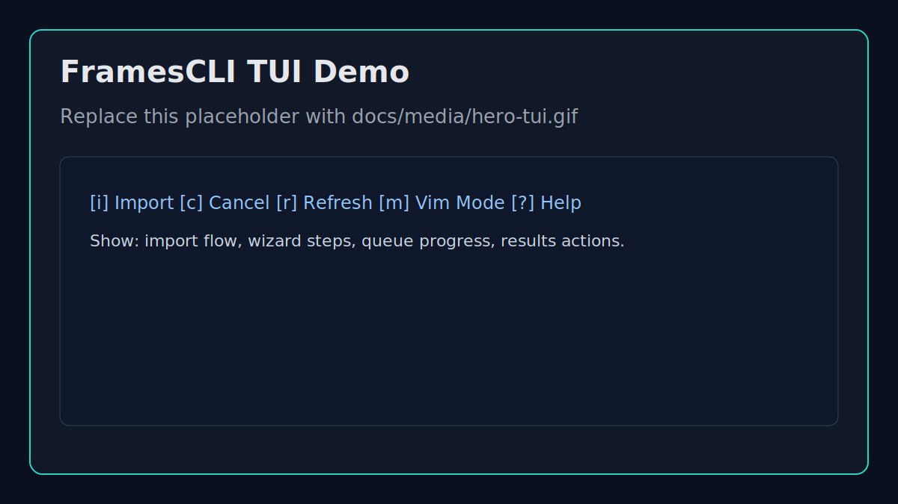
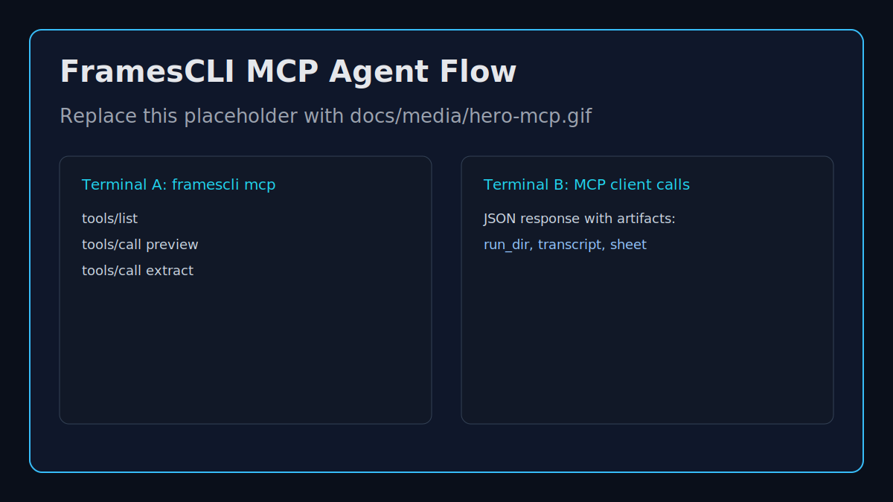

# FramesCLI


Turn screen recordings into agent-ready artifacts: frame timelines, contact sheets, metadata, audio, and transcripts.

FramesCLI is a Go CLI + TUI built for debugging, troubleshooting, and coding-session review workflows.

> [](https://github.com/wraelen/framescli/blob/main/go.mod)
> [](https://github.com/wraelen/framescli/actions)
> [](./LICENSE)
> [](https://github.com/wraelen/framescli/releases)

## Hero





Static preview artwork is included now. Replace with recorded product captures when available:

- `docs/media/hero-tui.gif` or `docs/media/hero-tui.svg`
- `docs/media/hero-mcp.gif` or `docs/media/hero-mcp.svg`

## Why Use It

- Make long recordings scannable with extracted frames and contact sheets
- Generate transcripts for quick semantic search and AI context
- Produce structured JSON outputs for automation and agent pipelines
- Run locally with file-system based workflows (no required cloud backend)

## Core Capabilities

- Video input handling and validation (duration, resolution, FPS)
- Frame extraction with timestamp/frame range controls
- Audio extraction with format + trim + normalize options
- Local transcription with selectable backend (`auto|whisper|faster-whisper`) and outputs (`txt`, `json`, `srt`, `vtt`)
- Batch processing across multiple files/globs
- Machine-readable `--json` outputs for automation
- Terminal TUI with extraction wizard, queueing, previews, and history
- MCP server mode (`framescli mcp`) for IDE/agent integration
- Diagnostics bundles for failed runs

## Install

### Requirements

- `ffmpeg`
- `ffprobe`
- `whisper` or `faster-whisper` (only required for transcription features)

### Install FramesCLI

Recommended for most users: install the latest prebuilt release binary.

```bash
curl -fsSL https://raw.githubusercontent.com/wraelen/framescli/main/scripts/install-release.sh | bash
framescli --help
```

Install a specific version:

```bash
curl -fsSL https://raw.githubusercontent.com/wraelen/framescli/main/scripts/install-release.sh | \
  bash -s -- --version v0.1.0
```

Install from source instead:

```bash
go install github.com/wraelen/framescli/cmd/frames@latest
framescli --help
```

Build locally from the checked-out repo:

```bash
go mod tidy
go build -o bin/framescli ./cmd/frames
./bin/framescli --help
```

Notes:

- The release installer places `framescli` into `~/.local/bin` by default.
- Package-manager distribution (`apt`, Homebrew, winget, etc.) is not set up yet.
- The local repo build helper remains available at `./scripts/install.sh`.

### Dependency Install

Recommended (repo script):

```bash
# Install required media deps (ffmpeg/ffprobe)
./scripts/install-deps.sh --install

# Include whisper as well
./scripts/install-deps.sh --install --with-whisper
```

Make targets:

```bash
make deps
make deps-whisper
```

Manual:

```bash
# macOS (Homebrew)
brew install ffmpeg

# Ubuntu/Debian/WSL
sudo apt install ffmpeg

# Fedora
sudo dnf install ffmpeg
```

### Whisper Install (Optional, for Transcription)

```bash
# macOS / Linux / WSL (recommended via pipx)
python3 -m pip install --user pipx
python3 -m pipx ensurepath
pipx install openai-whisper

# Alternate (venv/global pip)
pip install -U openai-whisper
```

Notes:

- A transcription backend is only required for `--voice`/`transcribe` workflows.
- Backend selection supports `auto|whisper|faster-whisper` (`auto` prefers `faster-whisper` when available).
- Verify install with `<backend-binary> --help`.
- Override backend per command:
  - `--transcribe-backend auto|whisper|faster-whisper`
  - `--transcribe-bin <path-or-name>`
  - `--transcribe-language <lang>`

### Quick Verification

```bash
framescli doctor
framescli preview recent --json
```

### Public Smoke Test

Run this before opening issues or publishing a release candidate:

```bash
# Uses a generated sample video
./scripts/public-smoke.sh

# Or test against your own recording
./scripts/public-smoke.sh --video /absolute/path/to/recording.mp4
```

Outputs are written to `tmp/public-smoke/` (doctor, preview, extract, batch, open-last, MCP smoke).

## 60-Second Quickstart

```bash
# 1) Validate local toolchain
framescli doctor

# 2) Preview a recording (no extraction yet)
framescli preview /path/to/recording.mp4 --mode both --json

# 3) Extract frames + transcript
framescli extract /path/to/recording.mp4 --voice --json

# 4) Open key artifact
framescli open-last --artifact transcript
```

## Command Overview

```bash
framescli extract <videoPath|recent> [fps] [--voice] [--format png|jpg] [--quality 1-31]
framescli extract-batch <videoPathOrGlob...> [--voice] [--from 00:30 --to 01:45]
framescli preview <videoPath|recent> [--fps 4 --format png --mode both]
framescli open-last [--artifact run|transcript|sheet|log|metadata|audio]
framescli copy-last [--artifact run|transcript|sheet|log|metadata|audio]
framescli import [videoPath] [--voice] [--fps 4] [--format png|jpg] [--no-modal]
framescli sheet <framesDir> [--cols 6] [--out contact-sheet.png]
framescli transcribe <audioPath> [outDir]
framescli clean [targetDir]
framescli tui [--root frames]
framescli doctor [--json] [--report] [--report-out path]
framescli index [rootDir] [--out index.json]
framescli benchmark <videoPath|recent> [--duration 20]
framescli benchmark history [--limit 20]
framescli telemetry status [--json]
framescli telemetry tail [-n 20]
framescli telemetry prune [--keep 2000]
framescli setup
framescli config
framescli mcp
framescli completion <bash|zsh|fish|powershell>
```

Primary command name is `framescli`.

## Common Workflows

### Extract Frames at Intervals

```bash
framescli extract /path/to/video.mp4 --fps 2 --format png
framescli extract /path/to/video.mp4 --every-n 10 --name-template "frame-%05d"
```

### Extract by Time or Frame Range

```bash
framescli extract /path/to/video.mp4 --from 00:30 --to 01:45
framescli extract /path/to/video.mp4 --frame-start 150 --frame-end 200
```

### Audio + Transcript

```bash
framescli extract /path/to/video.mp4 \
  --voice \
  --audio-format mp3 \
  --audio-from 00:10 \
  --audio-to 01:20 \
  --normalize-audio
```

### Batch Processing

```bash
framescli extract-batch "recordings/*.mp4" --voice --json
```

### Archive Outputs

```bash
framescli extract /path/to/video.mp4 --zip --metadata-csv
```

### Post-Process Hook (Optional)

Run a command after successful extraction to trigger adapters/uploader/indexers.

```bash
framescli extract /path/to/video.mp4 \
  --voice \
  --post-hook 'echo "new run: $FRAMESCLI_HOOK_OUT_DIR"' \
  --post-hook-timeout 45s
```

Security note: hooks execute via the system shell. Only use trusted commands and avoid untrusted interpolated input.

Available hook env vars:

- `FRAMESCLI_HOOK_EVENT` (`post_extract`)
- `FRAMESCLI_HOOK_INPUT`
- `FRAMESCLI_HOOK_VIDEO`
- `FRAMESCLI_HOOK_OUT_DIR`
- `FRAMESCLI_HOOK_ARTIFACTS_JSON`
- `FRAMESCLI_HOOK_RESULT_JSON`

## TUI

Launch:

```bash
framescli tui
```

Highlights:

- Import flow with in-terminal extraction wizard
- Queue multiple jobs and run sequentially
- Review step with sampled frame preview (`chafa` if available)
- Save reusable extraction profiles
- Retry failed queue jobs from result view
- Stage-aware progress + cancellation support
- Vim-mode keymap toggle (`m`)

Key bindings:

```text
[q] Quit
[i] Import video
[c] Cancel active extraction
[r] Refresh runs
[g] Guided tour
[m] Toggle vim keymap mode
[v] Cycle theme preset
[?] Help panel
[/] Filter runs
[Ctrl+k] Command menu
```

## Agent and MCP Integration

FramesCLI supports automation via both CLI JSON mode and MCP.

### Agent Quickstart (Copy/Paste)

```bash
# 1) Validate local readiness
framescli doctor --json

# 2) Start MCP server
framescli mcp
```

Then have your agent call tools in this order:

1. `prefs_set` with `input_dirs` and `output_root`
2. `preview` for the target video path
3. `extract` (or `extract_batch`) with `voice=true` when transcript is needed
4. `get_latest_artifacts` to ingest paths

### CLI JSON Contract

- `extract`, `extract-batch`, and `preview` support `--json`
- Envelope includes: `schema_version`, `command`, `status`, timing, `data`, optional `error`
- Schema version: `framescli.v1`
- Command failures return non-zero exit codes, including JSON-mode failures/partials

### MCP Server

Run over stdio:

```bash
framescli mcp
```

Tools:

- `preview`
- `extract`
- `extract_batch`
- `doctor`
- `open_last`
- `get_latest_artifacts`
- `prefs_get`
- `prefs_set`

Recommended MCP onboarding:

1. `framescli doctor --json`
2. Start `framescli mcp`
3. Call `prefs_set` to establish `input_dirs` and `output_root`
4. Run `preview` before extraction calls

Minimal MCP client config:

```json
{
  "mcpServers": {
    "framescli": {
      "command": "framescli",
      "args": ["mcp"]
    }
  }
}
```

Path safety:

- MCP access is local-only
- Path arguments are restricted to configured allowed roots + current working directory

## Output Layout

```text
frames/<RunName>/
  images/
    frame-0001.png
    sheets/contact-sheet.png
  voice/
    voice.wav
    transcript.txt
    transcript.json
    transcript.srt
    transcript.vtt
```

Failed-run diagnostics are exported under `frames/diagnostics/diag-*.json`.

## Performance and Setup

First-time setup:

```bash
framescli setup
framescli doctor
framescli config
```

Benchmarking:

```bash
framescli benchmark recent --duration 20
framescli benchmark recent --apply
framescli benchmark history --limit 20
```

Recommended baseline starting points:

- Linux desktop/workstation: `--hwaccel auto --preset balanced`
- Linux headless/CI: `--hwaccel none --preset safe`
- macOS: `--hwaccel auto --preset balanced`
- WSL: `--hwaccel none --preset balanced`

## Configuration

Default config path:

- `~/.config/framescli/config.json`

Override:

- `FRAMES_CONFIG=/path/to/config.json`

Environment variables:

- `OBS_VIDEO_DIR`
- `WHISPER_BIN`
- `FASTER_WHISPER_BIN`
- `WHISPER_MODEL`
- `WHISPER_LANGUAGE`
- `TRANSCRIBE_BACKEND` (`auto|whisper|faster-whisper`)

Hook config keys:

- `post_extract_hook` (string command)
- `post_extract_hook_timeout_sec` (integer seconds)

Telemetry config keys (opt-in, local-only):

- `telemetry_enabled` (`true`/`false`, default `false`)
- `telemetry_path` (optional JSONL file path override)

When enabled, FramesCLI appends JSONL events to:

- default: `frames/telemetry/events.jsonl`

Telemetry commands:

```bash
framescli telemetry status
framescli telemetry tail -n 25
framescli telemetry prune --keep 2000
```

## Reliability and Testing

```bash
make preflight
go test ./...
go test -tags integration ./internal/media
```

## Documentation

- Product + usage docs: `README.md`
- Ongoing build checklist: `docs/CHECKLIST.md`
- Agent workflow recipes: `docs/AGENT_RECIPES.md`
- Media capture guide for README visuals: `docs/media/README_MEDIA.md`
- Brand assets and logo checklist: `brand/BRAND.md`, `brand/CHECKLIST.md`
- Contributing guide: `CONTRIBUTING.md`
- License: `LICENSE`

## Roadmap Snapshot

See `docs/CHECKLIST.md` for the active must-have and post-launch items.
